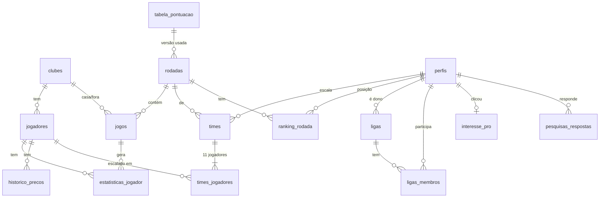

# Banco de Dados — Modelo e Campos

← [[Index]] · Contexto: [[Arquitetura]] · Origem dos dados: [[API-Football]] · Regras: [[Regras do Jogo]]

> [!abstract] Em uma frase
> **PostgreSQL (Supabase)** com **17 tabelas em 4 grupos**: catálogo esportivo espelhado da API-Football, jogo do usuário, social/validação e operação. O volume da validação é minúsculo (dezenas de milhares de linhas), e o plano grátis do Supabase (500 MB) sobra.

> [!note] Convenções
> - Nomes de tabela e coluna em **PT-BR, snake_case**, no plural para tabelas.
> - Tabelas espelhadas da API usam **o ID da API como chave primária** (`int`). Tabelas do app usam `uuid`.
> - Datas sempre em `timestamptz` (UTC no banco; exibição em `America/Sao_Paulo`).
> - Pontos e preços em `numeric`, **nunca `float`**, para o ranking não oscilar por arredondamento.
> - Todo registro tem `criado_em`; os que mudam têm `atualizado_em` (trigger).

---

## Diagrama

---

## Tipos enumerados

| Enum | Valores |
|---|---|
| `posicao` | `GOL`, `DEF`, `MEI`, `ATA` (a API só distingue G/D/M/F; ver [[Regras do Jogo]]) |
| `formacao` | `4-3-3`, `4-4-2`, `3-5-2` |
| `status_jogador` | `PROVAVEL`, `DUVIDA`, `LESIONADO`, `SUSPENSO` |
| `status_rodada` | `AGENDADA`, `ABERTA`, `EM_ANDAMENTO`, `FECHADA` |
| `status_jogo` | `A_JOGAR`, `EM_ANDAMENTO`, `ENCERRADO`, `ADIADO`, `CANCELADO` |
| `tipo_liga` | `CONVITE`, `ABERTA` |
| `tipo_sync` | `ELENCOS`, `LESOES`, `STATUS_RODADA`, `ESTATISTICAS_JOGO`, `CONFERENCIA_JOGO`, `FECHAMENTO_RODADA`, `PRECOS` |

**De `fixture.status.short` da API para `status_jogo`:** `TBD`, `NS` → `A_JOGAR` · `1H`, `HT`, `2H`, `ET`, `BT`, `P`, `INT`, `LIVE` → `EM_ANDAMENTO` · `FT`, `AET`, `PEN` → `ENCERRADO` · `PST`, `SUSP` → `ADIADO` · `CANC`, `ABD`, `AWD`, `WO` → `CANCELADO`.

---

## Grupo 1 · Catálogo esportivo (espelho da API-Football)

Escrita **só pelos jobs** (service role). Leitura pública.

### `clubes`

| Campo | Tipo | Regra | Origem |
|---|---|---|---|
| `id` | `int` PK | | `team.id` |
| `nome` | `text` not null | | `team.name` |
| `sigla` | `char(3)` unique not null | maiúsculas | `team.code` (**pode vir nulo**: preencher à mão) |
| `cor_primaria` | `char(7)` | hex `#RRGGBB` | **manual** (a API não fornece) |
| `cor_secundaria` | `char(7)` | hex | **manual** |
| `ativo` | `bool` default `true` | clube na Série A da temporada | |
| `api_atualizado_em` | `timestamptz` | | job |

> [!warning] Sem escudo
> A API entrega `team.logo`, mas **não se usa**: escudo é marca registrada (ver [[Jurídico e Riscos]]). O app desenha a camisa genérica com `cor_primaria`/`cor_secundaria`.

### `jogadores`

| Campo | Tipo | Regra | Origem |
|---|---|---|---|
| `id` | `int` PK | | `player.id` |
| `clube_id` | `int` FK → `clubes` not null | | `/players/squads` |
| `nome` | `text` not null | | `player.name` |
| `nome_exibicao` | `text` not null | até 16 caracteres, para o chip do campo | derivado (editável) |
| `numero` | `smallint` | | `player.number` |
| `posicao` | `posicao` not null | | `player.position` → G/D/M/F |
| `preco` | `numeric(5,2)` not null | `2,00 ≤ preco ≤ 20,00` | calculado |
| `preco_inicial` | `numeric(5,2)` not null | | calculado na carga |
| `media_temporada` | `numeric(5,2)` default 0 | | calculado |
| `media_ult5` | `numeric(5,2)` default 0 | média dos últimos 5 jogos com minutos > 0 | calculado |
| `jogos_temporada` | `smallint` default 0 | | calculado |
| `status` | `status_jogador` default `PROVAVEL` | | `/injuries` (`player.type`: "Missing Fixture" → `LESIONADO`/`SUSPENSO`; "Questionable" → `DUVIDA`) |
| `status_motivo` | `text` | ex.: "Lesão muscular" | `player.reason` |
| `ativo` | `bool` default `true` | `false` quando sai do elenco | job |
| `api_atualizado_em` | `timestamptz` | | job |

Índices: `(clube_id)`, `(posicao, preco)`, `(ativo)`.

### `rodadas`

| Campo | Tipo | Regra | Origem |
|---|---|---|---|
| `id` | `serial` PK | | |
| `temporada` | `smallint` not null | ex.: 2026 | config |
| `numero` | `smallint` not null | 1–38 | extraído de `league.round` |
| `rotulo_api` | `text` not null | ex.: "Regular Season - 29" | `league.round` |
| `status` | `status_rodada` not null | | job |
| `abre_em` | `timestamptz` | quando a anterior fecha | job |
| `trava_em` | `timestamptz` not null | = menor `jogos.inicio_em` da rodada | job (**recalcular se houver remarcação**) |
| `fechada_em` | `timestamptz` | | job |
| `versao_regras` | `smallint` FK → `tabela_pontuacao.versao` not null | congela as regras da rodada | config |
| **Único** | `(temporada, numero)` | | |

### `jogos`

| Campo | Tipo | Regra | Origem |
|---|---|---|---|
| `id` | `int` PK | | `fixture.id` |
| `rodada_id` | `int` FK → `rodadas` not null | | |
| `clube_casa_id` | `int` FK → `clubes` not null | | `teams.home.id` |
| `clube_fora_id` | `int` FK → `clubes` not null | | `teams.away.id` |
| `inicio_em` | `timestamptz` not null | | `fixture.date` |
| `status` | `status_jogo` not null | | mapeado de `fixture.status.short` |
| `status_api` | `varchar(5)` | valor cru, para depuração | `fixture.status.short` |
| `gols_casa` | `smallint` | | `goals.home` |
| `gols_fora` | `smallint` | | `goals.away` |
| `pontuado_em` | `timestamptz` | 1ª leitura das estatísticas | job |
| `conferido_em` | `timestamptz` | 2ª leitura, no dia seguinte | job |
| `api_atualizado_em` | `timestamptz` | | job |

Índices: `(rodada_id)`, `(status, inicio_em)` (o job de polling procura "jogos que deveriam ter acabado").

### `estatisticas_jogador` (scouts por jogo)

Uma linha por jogador que **entrou em campo** num jogo.

| Campo | Tipo | Origem (`/fixtures/players` ou `/fixtures?id=`) |
|---|---|---|
| `jogo_id` | `int` FK → `jogos` · **PK composta** | `fixture.id` |
| `jogador_id` | `int` FK → `jogadores` · **PK composta** | `player.id` |
| `rodada_id` | `int` FK → `rodadas` (desnormalizado) | |
| `clube_id` | `int` FK → `clubes` | `team.id` |
| `minutos` | `smallint` | `games.minutes` |
| `posicao_jogo` | `char(1)` | `games.position` (G/D/M/F) |
| `substituto` | `bool` | `games.substitute` |
| `nota_api` | `numeric(3,1)` | `games.rating` (só exibição) |
| `gols` | `smallint` default 0 | `goals.total` |
| `assistencias` | `smallint` default 0 | `goals.assists` |
| `finalizacoes` | `smallint` default 0 | `shots.total` |
| `finalizacoes_no_gol` | `smallint` default 0 | `shots.on` |
| `desarmes` | `smallint` default 0 | `tackles.total` |
| `faltas_sofridas` | `smallint` default 0 | `fouls.drawn` |
| `faltas_cometidas` | `smallint` default 0 | `fouls.committed` |
| `impedimentos` | `smallint` default 0 | `offsides` |
| `amarelos` | `smallint` default 0 | `cards.yellow` |
| `vermelhos` | `smallint` default 0 | `cards.red` |
| `defesas` | `smallint` default 0 | `goals.saves` |
| `gols_sofridos` | `smallint` default 0 | `goals.conceded` |
| `penaltis_sofridos` | `smallint` default 0 | `penalty.won` |
| `penaltis_cometidos` | `smallint` default 0 | `penalty.commited` (grafia da API) |
| `penaltis_perdidos` | `smallint` default 0 | `penalty.missed` |
| `penaltis_defendidos` | `smallint` default 0 | `penalty.saved` |
| `gols_contra` | `smallint` default 0 | `/fixtures/events` `detail = "Own Goal"` |
| `sem_sofrer_gol` | `bool` | derivado: gols do adversário = 0 **e** `minutos ≥ 60` |
| `pontos` | `numeric(6,2)` not null | calculado com `tabela_pontuacao` |
| `versao_leitura` | `smallint` | 1 = fim do jogo · 2 = conferência |
| `payload_api` | `jsonb` | **resposta crua** do jogador, para auditoria e recálculo |
| `lido_em` | `timestamptz` | |

> [!important] Por que guardar o `payload_api`
> A API manda `null` em vez de 0 em vários campos, e os scouts são corrigidos depois do jogo. Com o JSON cru dá para recalcular a rodada inteira sem gastar requisição, que é escassa (100/dia). Tratar `null` como 0 **na carga**, nunca no cálculo.

Índices: `(rodada_id, jogador_id)` (soma da rodada), `(jogador_id, lido_em desc)` (média dos últimos 5).

### `tabela_pontuacao` (regras versionadas)

| Campo | Tipo | Regra |
|---|---|---|
| `versao` | `smallint` · **PK composta** | |
| `scout` | `text` · **PK composta** | ex.: `gols`, `desarmes`, `sem_sofrer_gol` |
| `posicao` | `posicao` · **PK composta** | uma linha por posição que pontua naquele scout |
| `pontos` | `numeric(4,2)` not null | ex.: 8,00 · −0,30 |
| `publicada_em` | `timestamptz` not null | |

A tabela da tela "Como Funciona" é lida daqui. Cada rodada aponta para a versão vigente (`rodadas.versao_regras`), então **mudar a regra no meio da temporada não altera rodada passada**.

### `historico_precos`

| Campo | Tipo | Regra |
|---|---|---|
| `jogador_id` | `int` FK · **PK composta** | |
| `rodada_id` | `int` FK · **PK composta** | preço **válido para** esta rodada |
| `preco` | `numeric(5,2)` not null | |
| `variacao` | `numeric(4,2)` not null | alimenta o ▲/▼ do mercado |

---

## Grupo 2 · Jogo do usuário

### `perfis`

O e-mail e o login ficam em `auth.users` (Supabase Auth) e **não são duplicados** aqui.

| Campo | Tipo | Regra |
|---|---|---|
| `id` | `uuid` PK = `auth.users.id` | |
| `apelido` | `citext` unique not null | 3–20 caracteres, `^[A-Za-z0-9_.]+$`, filtro de palavrão |
| `clube_coracao_id` | `int` FK → `clubes` | alimenta o ranking "Por clube do coração" |
| `convidado_por` | `uuid` FK → `perfis` | primeiro convite que trouxe o usuário (métrica de viralidade) |
| `origem` | `text` | `utm_source` do primeiro acesso |
| `tema` | `text` default `escuro` | `escuro` / `claro` |
| `notificacoes_email` | `bool` default `true` | |
| `termos_versao` | `text` not null | |
| `termos_aceitos_em` | `timestamptz` not null | prova de aceite (LGPD) |
| `criado_em` · `atualizado_em` | `timestamptz` | |

### `times` (a escalação do usuário numa rodada)

| Campo | Tipo | Regra |
|---|---|---|
| `id` | `uuid` PK | |
| `usuario_id` | `uuid` FK → `perfis` not null | |
| `rodada_id` | `int` FK → `rodadas` not null | |
| `formacao` | `formacao` not null | |
| `custo` | `numeric(6,2)` not null | `≤ 100,00` na hora de salvar |
| `pontos` | `numeric(7,2)` default 0 | soma de `times_jogadores.pontos` |
| `gols_escalados` | `smallint` default 0 | 2º critério de desempate |
| `salvo_em` | `timestamptz` not null | último salvamento antes da trava · 4º critério de desempate |
| `criado_em` · `atualizado_em` | `timestamptz` | |
| **Único** | `(usuario_id, rodada_id)` | 1 time por rodada no MVP |

### `times_jogadores`

| Campo | Tipo | Regra |
|---|---|---|
| `time_id` | `uuid` FK → `times` on delete cascade · **PK composta** | |
| `jogador_id` | `int` FK → `jogadores` · **PK composta** | |
| `posicao` | `posicao` not null | = `jogadores.posicao` |
| `preco_pago` | `numeric(5,2)` not null | **foto do preço** no momento do salvamento |
| `pontos` | `numeric(6,2)` default 0 | copiado de `estatisticas_jogador` quando o jogo do jogador acaba |
| `pontuado` | `bool` default `false` | alimenta "aguardando" × pontos no chip |

### `ranking_rodada` (materializado pelo job)

| Campo | Tipo | Regra |
|---|---|---|
| `rodada_id` | `int` FK · **PK composta** | |
| `usuario_id` | `uuid` FK · **PK composta** | |
| `pontos` | `numeric(7,2)` not null | |
| `posicao` | `int` not null | `RANK()` com os critérios de desempate |
| `posicao_anterior` | `int` | antes do último jogo pontuado → ▲/▼ |
| `atualizado_apos_jogo_id` | `int` FK → `jogos` | selo "atualizado após FLA × PAL" |

Índice: `(rodada_id, posicao)`.

---

## Grupo 3 · Social e validação

### `ligas`

| Campo | Tipo | Regra |
|---|---|---|
| `id` | `uuid` PK | |
| `nome` | `text` not null | 3–40 caracteres |
| `icone` | `text` | emoji |
| `dono_id` | `uuid` FK → `perfis` not null | |
| `tipo` | `tipo_liga` default `CONVITE` | |
| `codigo_convite` | `varchar(8)` unique not null | alfanumérico sem caracteres ambíguos (sem 0/O, 1/I) |
| `temporada` | `smallint` not null | |
| `criada_em` · `arquivada_em` | `timestamptz` | |

### `ligas_membros`

| Campo | Tipo | Regra |
|---|---|---|
| `liga_id` | `uuid` FK → `ligas` on delete cascade · **PK composta** | |
| `usuario_id` | `uuid` FK → `perfis` · **PK composta** | |
| `convidado_por` | `uuid` FK → `perfis` | quem mandou o link (métrica de convite aceito) |
| `entrou_em` | `timestamptz` not null | |

O ranking da liga é uma **view**: `ranking_rodada` ⋈ `ligas_membros`, com a posição recalculada dentro da liga. Limite sugerido: 200 membros por liga.

### `interesse_pro` (fake door)

| Campo | Tipo | Regra |
|---|---|---|
| `usuario_id` | `uuid` PK FK → `perfis` | 1 clique por usuário conta |
| `origem_tela` | `text` | de onde veio (Início, Ranking…) |
| `clicou_em` | `timestamptz` not null | |

### `pesquisas_respostas`

| Campo | Tipo | Regra |
|---|---|---|
| `id` | `uuid` PK | |
| `usuario_id` | `uuid` FK → `perfis` not null | |
| `pesquisa` | `text` not null | `apos_rodada_2`, `apos_rodada_4` |
| `nps` | `smallint` | 0–10 |
| `motivos` | `text[]` | opções marcadas |
| `pagaria_pro` | `bool` | "Pagaria R$ 9,90/mês?" |
| `comentario` | `text` | até 500 caracteres |
| `respondido_em` | `timestamptz` not null | |
| **Único** | `(usuario_id, pesquisa)` | |

---

## Grupo 4 · Operação

### `sync_execucoes` (log dos jobs e controle da cota da API)

| Campo | Tipo | Regra |
|---|---|---|
| `id` | `bigserial` PK | |
| `tipo` | `tipo_sync` not null | |
| `referencia` | `text` | ex.: `fixture=1234`, `rodada=29` |
| `iniciado_em` · `terminado_em` | `timestamptz` | |
| `requisicoes` | `smallint` not null | chamadas feitas nesta execução |
| `cota_restante` | `int` | lida do header de limite diário devolvido pela API |
| `sucesso` | `bool` not null | |
| `erro` | `text` | |

> [!important] A cota é de 100 requisições/dia
> Todo job **consulta a soma de `requisicoes` do dia** antes de chamar a API e se recusa a rodar abaixo de uma reserva (ex.: 15). Isso garante que sobra cota para pontuar os jogos que terminam à noite.

### `configuracoes`

Chave-valor para ajustes sem deploy: `temporada_atual`, `liga_api_id` (71), `orcamento` (100), `reserva_cota_api` (15), `pesquisa_ativa`.

---

## Regras no banco (funções e triggers)

| Nome | Tipo | O que garante |
|---|---|---|
| `fn_validar_time` | trigger em `times`/`times_jogadores` | 11 jogadores; quantidade por posição = formação; `custo ≤ orcamento`; jogador `ativo` |
| `fn_bloquear_pos_trava` | trigger | nenhum insert/update/delete em `times` e `times_jogadores` depois de `rodadas.trava_em` |
| `fn_pontuar_jogo(jogo_id)` | função | calcula `estatisticas_jogador.pontos`, copia para `times_jogadores`, soma em `times`, regrava `ranking_rodada` |
| `fn_fechar_rodada(rodada_id)` | função | 2ª leitura conferida, ranking final, `status = FECHADA`, abre a próxima |
| `fn_atualizar_precos(rodada_id)` | função | recalcula médias e preço e grava `historico_precos` para a rodada seguinte |
| `fn_entrar_liga(codigo)` | RPC | entra na liga pelo código de convite e registra `convidado_por` |

---

## Segurança (Row Level Security do Supabase)

| Tabela | Leitura | Escrita |
|---|---|---|
| `clubes`, `jogadores`, `rodadas`, `jogos`, `estatisticas_jogador`, `tabela_pontuacao`, `historico_precos` | pública | só service role (jobs) |
| `perfis` | `apelido` e `clube_coracao_id` públicos (ranking); o resto só o próprio | o próprio |
| `times`, `times_jogadores` | o próprio sempre; **os outros só depois da trava** (ninguém copia o time alheio antes do jogo) | o próprio, antes da trava |
| `ranking_rodada` | pública | service role |
| `ligas` | membros | dono edita; criar é aberto |
| `ligas_membros` | membros da mesma liga | via `fn_entrar_liga`; sair é o próprio |
| `interesse_pro`, `pesquisas_respostas` | o próprio | o próprio (insert) |
| `sync_execucoes`, `configuracoes` | service role | service role |

A **chave da API-Football nunca vai para o front**: só os jobs no servidor a usam.

---

## Volume esperado (validação: 500 usuários, 6 rodadas)

| Tabela                 |                                    Linhas |
| ---------------------- | ----------------------------------------: |
| `clubes`               |                                        20 |
| `jogadores`            |                                      ~600 |
| `jogos`                |                          380 na temporada |
| `estatisticas_jogador` |       ~30 por jogo → ~11.400 na temporada |
| `times`                |                                    ~3.000 |
| `times_jogadores`      |                                   ~33.000 |
| `ranking_rodada`       |                                    ~3.000 |
| **Total**              | **< 100 mil linhas, bem abaixo de 50 MB** |

---

## LGPD: dados pessoais guardados

Só **e-mail** (em `auth.users`), **apelido**, **clube do coração**, **origem** e as respostas de pesquisa. **Sem CPF, telefone ou endereço na validação.** A exclusão de conta:
- apaga `auth.users`, `perfis`, `interesse_pro` e `pesquisas_respostas`;
- mantém as linhas de ranking das rodadas passadas **anonimizadas** ("Jogador removido"), para a classificação dos outros não mudar.

Quando entrar prêmio, a tabela `perfis` ganha CPF (criptografado), telefone verificado e chave PIX validada contra o CPF. Ver [[Jurídico e Riscos]].

---

*Criado em 28/09/2026. Campos da API conforme a documentação pública da API-Football v3: **conferir contra a resposta real** no primeiro teste com a chave grátis.*
